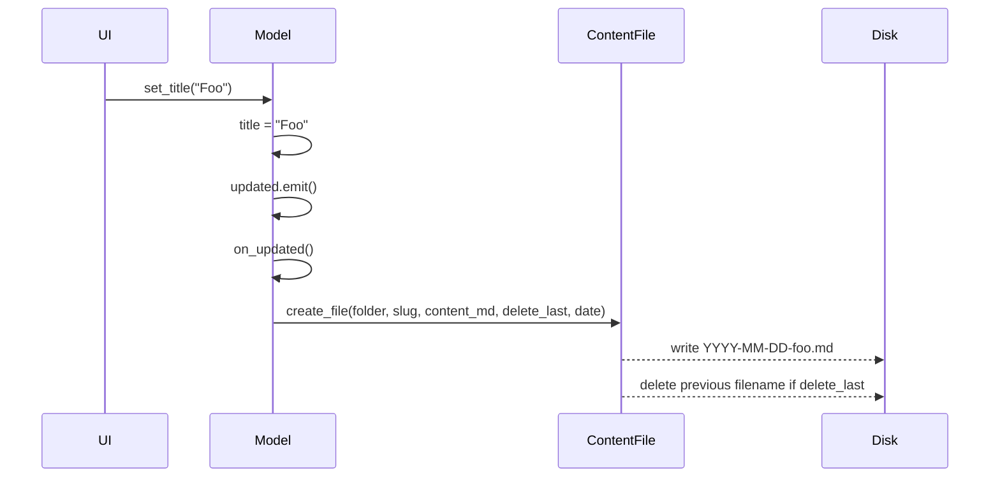

# ArticleModel

`ArticleModel(QObject)` in `model.py`. One instance per language (`hl="fr"` or `hl="en"`).

## State (instance attributes)

- `hl: str` — language code; threads through INI loading, file naming, social posts.
- `title: str`, `content: str`, `excerpt_image: str`, `tags: str` (default `"Gamsblurb"`), `date: str` (default = today, `YYYY-MM-DD`).
- `links: list[Link]` — populated via `set_link(text, url)`.
- `mini: bool`, `medium: bool` — length category flags (see [post-routing.md](post-routing.md)).
- `green: bool`, `black: bool` — title-color toggles for the image surface.
- `ref: ArticleModel | None` — the paired other-language model. Set externally via `set_ref(ref)`.
- `delete_last: bool` (default True) — gates rename-by-delete in `on_updated`.
- `content_file: ContentFile` — the persistence helper.
- `config: ConfigParser` — reads `settings_<hl>.ini` (`[Paths]:Posts`, `[URLs]:Website`).

## Signal
- `updated = Signal()` — connected to `on_updated` in `__init__`. Every property setter that detects a real change emits this.

## Lifecycle

`on_updated` always writes via `content_md()` (the full Jekyll flavor). UI re-render is driven by Qt's `Property notify` mechanism — every property is `Property(T, getter, setter, notify=updated)`.

## Slots / Qt Properties

Naming: `p_<name>` is the QML-exposed `Property`; `get_<name>` and `set_<name>` are the underlying Slots.

- `p_posts_folder`, `p_website_url` — `[Paths]` and `[URLs]` from the INI; setter writes the INI back.
- `p_title`, `p_date`, `p_slug` (read-only), `p_content`, `p_tags`, `p_excerpt_img`.
- `p_green`, `p_black`, `p_mini`, `p_medium`.
- `p_content_md`, `p_content_md_rich`, `p_content_md_separators`, `p_content_md_separators_br`, `p_content_short` — the five rendered flavors. See [rendering.md](rendering.md).
- `p_link_medium`, `p_link_x`, `p_link_typeshare`, `p_link_linkedin`, `p_link_facebook`, `p_link_source`, `p_link_bluesky`, `p_link_YouTube`, `p_link_YouTubeShorts`, `p_link_based_on` — read-only views into `links`. See [links.md](links.md).

## Article navigation slots

- `open_last_article()` — auto-called from `Backend.__init__` for the FR side. Scans `posts_folder` for the lexicographically-last `.md` and loads it via `change_article`. (Lex-last == date-last because filenames are date-prefixed.)
- `open_article()` — `QFileDialog` to pick any `.md` from `posts_folder`.
- `open_prev_article()` / `open_next_article()` — walk to adjacent file in directory listing relative to current `date+slug`.
- `new_article(copy_current=False)` — clears state. With `copy_current=True`: keeps title (suffixed " V2") and the current content, plus seeds the "Based on" / "Basé sur" link to the current website URL.
- `new_both_articles(copy_current)` — calls `ref.new_article` then `self.new_article`. Toggles `delete_last=False` around the pair so neither side clobbers the other's file mid-transition.

## change_article(file_contents, old_date, change_ref=True)

Loads an existing Jekyll file into the model. Parses `file_contents.split("---")`:

- Part 1 = frontmatter (yaml). Reads `title`, `excerpt_image`, `tags`, `ref`.
- Part 2 = body. Strips a leading `### **<title>**` line if present.
- Part 3 (optional) = footer. Regex `\[(name)]\((http[s]?://url)\)` extracts each link and seeds `links`.

If `change_ref=True` and frontmatter has a `ref:` URL, derives the reciprocal filename `<old_date>-<ref-without-website>.md` in the *other* language's posts folder. If it exists, recurses into `self.ref.change_article(..., change_ref=False)` to load the paired side. Otherwise calls `self.ref.new_article()`.

`delete_last` is forced False during the load and restored after, so loading does not delete the file on disk.

## Templating helper

`templated(template) -> str` — substitutes `<TITLE>`, `<EXCERPT_IMAGE>`, `<CONTENT>`, `<TAGS>`, `<FOOTER>`, `<CATEGORIES>`, `<REF>` in any of the four template strings loaded from `templates/` at init.

## Slug rule

`get_slug()` = `unidecode(title)` → replace `.` and ` ` with `-` → collapse repeated `-` → lowercase → strip non-alphanumeric (preserves `-`) → trim trailing `-`. Drives both the filename and the `<REF>` placeholder for the *other* language.

## See also
- [articles-model.md](articles-model.md)
- [rendering.md](rendering.md)
- [post-routing.md](post-routing.md)
- [links.md](links.md)
- [../file-storage/jekyll-format.md](../file-storage/jekyll-format.md)
