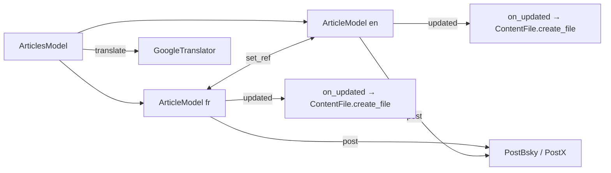

# model.py — Summary

`model.py` (727 lines, OVER 350-line limit — see [../practices.md](../practices.md)) holds article data + rendering + persistence + posting glue.

Three classes:
- `Link` (dataclass) — `(url, text)` pair.
- `ArticleModel(QObject)` — one per language. State + every `set_*` slot + the `updated` Signal that drives auto-save and UI re-render. See [article-model.md](article-model.md).
- `ArticlesModel(QObject)` — pairs FR + EN, owns `translate`. See [articles-model.md](articles-model.md).

## Module-level
- `DEFAULT_TAGS = "Gamsblurb"` — seed tag value, also kept in the rendered hashtag list.

## Files in this folder
- [article-model.md](article-model.md) — props, signals, slots, lifecycle, `change_article` parser
- [articles-model.md](articles-model.md) — FR/EN pairing + reciprocal `ref` file lookup
- [translation.md](translation.md) — Google Translator src→empty-dst mirroring
- [rendering.md](rendering.md) — the five `content_md_*` flavors
- [post-routing.md](post-routing.md) — text-vs-image fallback, length thresholds
- [links.md](links.md) — named link slots, footer rendering

## See also
- [../file-storage/jekyll-format.md](../file-storage/jekyll-format.md) — the file `content_md` produces
- [../posting/summary.md](../posting/summary.md) — what `ArticleModel.post` invokes
