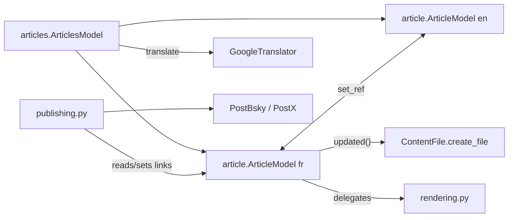

# Model layer — Summary

The Qt-free data + rendering layer. Split out of the old monolithic `model.py` (now legacy) into focused modules:

- `article.py` — `ArticleModel` (one per language) + `Link`. State, setters (each calls `self.updated()` → auto-save), slug, length category, links, navigation (`open_*`/`new_*`), and the `change_article` parser. See [article-model.md](article-model.md).
- `rendering.py` — pure functions producing the five `content_md_*` flavors, footer, categories, hashtags, plain-text extraction, and local-image embedding as data URLs. No state of its own; takes an `article`. See [rendering.md](rendering.md).
- `articles.py` — `ArticlesModel` pairs FR + EN (`create(config_dir)` factory wires `set_ref` both ways) and owns `translate`. See [articles-model.md](articles-model.md) and [translation.md](translation.md).
- `publishing.py` — the two-phase social-post flow (`prepare_post`/`publish`) + `PLATFORMS` registry. See [post-routing.md](post-routing.md) and [../posting/popup-flow.md](../posting/popup-flow.md).

## Key contracts
- `ArticleModel.__init__(hl, config_dir=".")` — `config_dir` locates `settings_<hl>.ini` (tests point it at a temp dir).
- `DEFAULT_TAGS = "Gamsblurb"` lives in `article.py` — seed tag, always-present category.
- Rendering functions live in `rendering.py` but `ArticleModel` exposes thin `content_md*()` methods that delegate, so callers can use either.

## No Qt
None of these import PySide6. They are unit-tested directly (see `tests/`). The legacy `model.py`/`backend.py` keep the Qt versions for `writerhelper_qt.py`.

## Files in this folder
- [article-model.md](article-model.md) — fields, setters, lifecycle, `change_article` parser
- [articles-model.md](articles-model.md) — FR/EN pairing + reciprocal `ref` file lookup
- [translation.md](translation.md) — Google Translator src→empty-dst mirroring
- [rendering.md](rendering.md) — the five `content_md_*` flavors
- [post-routing.md](post-routing.md) — text-vs-image decision
- [links.md](links.md) — named link slots, footer rendering

## See also
- [../file-storage/jekyll-format.md](../file-storage/jekyll-format.md) — the file `content_md` produces
- [../web-ui/bridge.md](../web-ui/bridge.md) — how the UI reaches these
