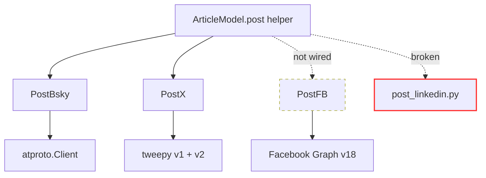

# Posting — Summary

Per-platform social-media adapters. Each is a thin Python wrapper around the platform's SDK or REST API, configured via a gitignored `[Access]` INI.

## Status by platform

| File | Class | Inherits Post? | Wired into UI? | Notes |
|---|---|---|---|---|
| `post_bsky.py` | `PostBsky` | ✅ | ✅ | Bluesky publish button → popup → `publishing.publish` |
| `post_x.py` | `PostX` | ✅ | ✅ | X/Twitter publish button → popup → `publishing.publish` |
| `post_fb.py` | `PostFB` | ❌ | ❌ | Older API; no UI hook |
| `post_linkedin.py` | none (broken) | n/a | ❌ | Unindented snippet; do NOT import |

The adapters (`post.py`, `post_bsky.py`, `post_x.py`) are unchanged; they are now invoked through `publishing.py` rather than `ArticleModel.post`.

## Routing

Now via the two-phase `publishing.py` flow behind a confirmation popup (see [popup-flow.md](popup-flow.md)). `prepare_post` computes the preview (no side effects); on confirm `publish`:
1. Guards against an existing link for the slot.
2. Calls `poster.post(msg, image_local_url, alt_text)` and gets a URL back.
3. Saves the URL as a `Link` under the slot name — which re-saves the `.md` file's footer.
4. Opens the URL in the system browser via `webbrowser.open`.

## Files in this folder
- [popup-flow.md](popup-flow.md) — `publishing.py` prepare/publish + the confirmation popup
- [post-base.md](post-base.md) — `Post` base class, INI shape, override pattern
- [bluesky.md](bluesky.md) — atproto.Client; text or send_image
- [x.md](x.md) — tweepy v1+v2 (v1 needed for media upload)
- [facebook.md](facebook.md) — Graph v18 token+page_id; not in UI flow
- [linkedin.md](linkedin.md) — BROKEN, hardcoded tokens, do not import

## See also
- [../model/post-routing.md](../model/post-routing.md)
- [../practices.md](../practices.md)
