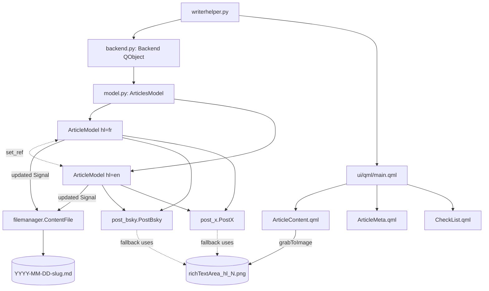

# WriterHelper — Summary

Personal bilingual (FR/EN) blog-authoring desktop app for [martingamsby.github.io](https://martingamsby.github.io/) (a Jekyll site).
Pairs FR + EN articles side-by-side, auto-saves Jekyll posts on every edit, renders branded image cards from rich-text content via QML `grabToImage`, and posts to BlueSky and X (text if it fits the platform limit, else title + the generated PNG).

Stack: Python 3 + PySide6 (QtCore/QtWidgets/QtQml/QtGui) + QtQuick/QML + atproto, tweepy, deep_translator, requests, markdown, beautifulsoup4, pyyaml, unidecode.
Packaged with PyInstaller (`writerhelper.spec`). Single-user, Windows.

Two `ArticleModel` instances live for the whole session — one `hl="fr"`, one `hl="en"` — paired by `set_ref` so each knows the other's website URL for the Jekyll `ref:` field.
The UI (`main.qml`) shows up to four columns: FR meta | FR content | EN content | EN meta. The FR/EN column visibility is toggled by checkboxes in the title bar.

## See also
- [terminology.md](terminology.md)
- [practices.md](practices.md)
- [memory-map.md](memory-map.md)
