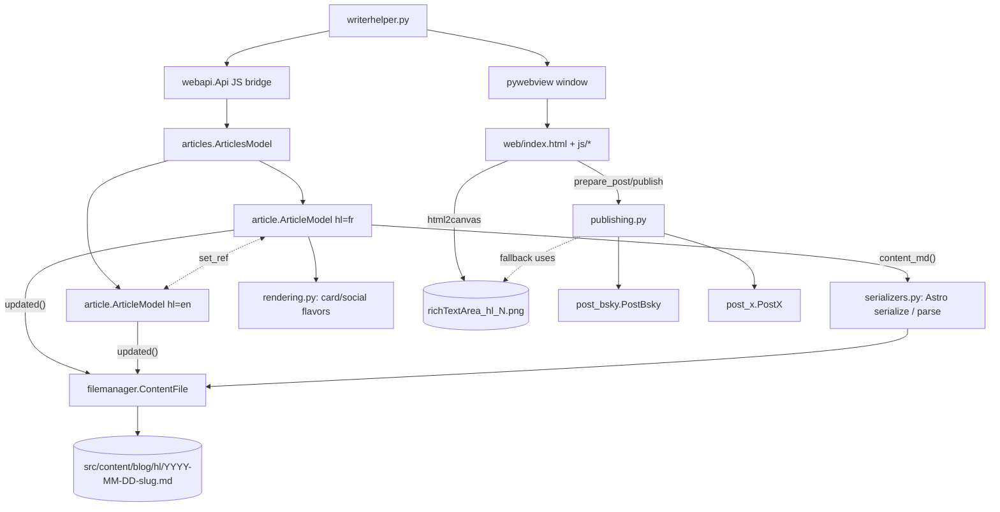

# WriterHelper — Summary

Personal bilingual (FR/EN) blog-authoring desktop app for the **Astro** site
[martingamsby.com](https://martingamsby.com/) (repo `martingamsby.com`, one bilingual
site replacing the two old Jekyll blogs).
Pairs FR + EN articles side-by-side, auto-saves **Astro** posts on every edit (FR/EN
twins coupled by a sticky `translationKey`; pair-shared `facets`/`draft`), renders
branded image cards from the content, and posts to BlueSky and X — through a
**confirmation popup** that previews the exact text/image before anything is sent
(text if it fits the platform limit, else title + the generated PNG). The format seam
lives in `serializers.py`; old Jekyll posts stay loadable via auto-detection. See
[file-storage/astro-format.md](file-storage/astro-format.md).

## Current architecture (pywebview + web UI)

The app is a **pywebview** window hosting an HTML/CSS/JS frontend. Python holds all logic (Qt-free); JS calls it over the `window.pywebview.api` bridge.

Two `ArticleModel` instances live for the whole session — one `hl="fr"`, one `hl="en"` — paired by `set_ref` so each knows the other's website URL for the Jekyll `ref:` field.
The web UI shows up to four columns: FR meta | FR content | EN content | EN meta, plus a checklist sidebar. FR/EN visibility toggled by checkboxes in the top bar.

Stack: Python 3 + pywebview (Edge WebView2 on Windows) + atproto, tweepy, deep_translator, requests, markdown, beautifulsoup4, pyyaml, unidecode. Frontend: vanilla JS + html2canvas (vendored). Packaged with PyInstaller (`writerhelper.spec`). Single-user, Windows.

## Legacy Qt path (still present)

The original PySide6/QML UI is preserved: `writerhelper_qt.py` → `backend.py` → `model.py` → `ui/qml/`. It still runs but is no longer the primary entry point. New work goes in the web stack. See [ui/summary.md](ui/summary.md) (marked legacy).

## See also
- [terminology.md](terminology.md)
- [practices.md](practices.md)
- [memory-map.md](memory-map.md)
