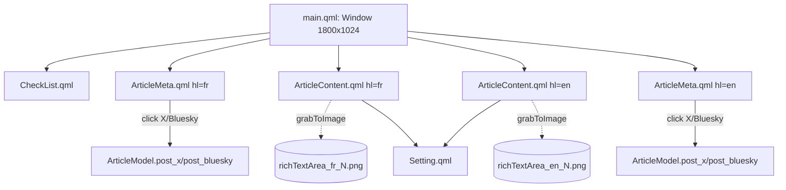

# UI — Summary

QML-based UI under `ui/qml/`. PySide6 loads `main.qml` via `QQmlApplicationEngine` in `writerhelper.py`, exposes the `Backend` QObject as the root `backend` property, and the QML accesses everything via `root.backend`.



Title bar has two checkboxes (French, English) that toggle visibility of the FR/EN columns. With both checked: 4-column layout. With one: that one fills the width.

Each `ArticleContent` and `ArticleMeta` instance binds to one language's `ArticleModel` via:

```qml
required property string hl
property QtObject hl_model: root.backend ? root.backend.article(hl) : null
```

All bindings then go through `hl_model.p_*` properties.

## Files in this folder
- [qml-tree.md](qml-tree.md) — per-component summary and what each binds to
- [image-capture.md](image-capture.md) — `grabToImage` callback chain, sizing, naming
- [checklist.md](checklist.md) — `CheckList.qml` manual workflow

## See also
- [../model/article-model.md](../model/article-model.md) — the `p_*` properties
- [../model/post-routing.md](../model/post-routing.md) — what the X/Bluesky label clicks trigger
