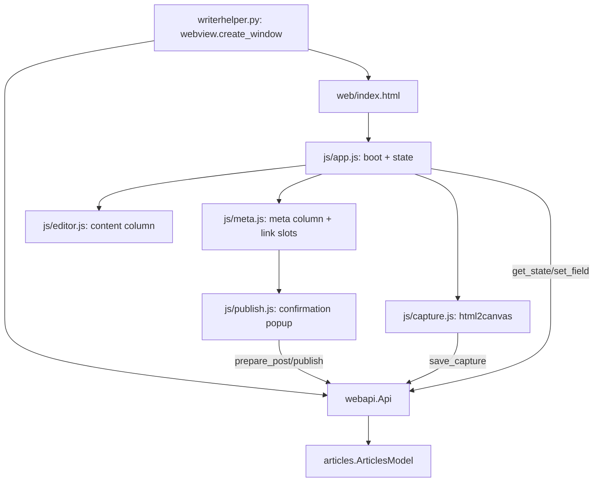

# Web UI — Summary

The current UI: a pywebview window (`writerhelper.py`) hosting `web/index.html`. Python exposes `webapi.Api` as `js_api`; JS reaches it via `window.pywebview.api`.

## Layout
Top bar (green strip): title + FR/EN visibility checkboxes + fr-CA clock. Then a flex row: checklist sidebar | FR meta | FR content | EN content | EN meta. Columns are plain `<section>`s; hiding toggles a `.hidden` class. Matches the old QML 4-column layout.

## Pull-based state
No push from Python. `App.refresh(hl)` calls `get_state(hl)`, stores it in `App.state[hl]`, and hands it to `Editor.apply` + `Meta.apply`. Every mutation (`setField`, `setLink`, action buttons) awaits the bridge then refreshes. Inputs are debounced (~600ms) and skipped if the user is focused in them (`App.setValue`).

## JS modules
- `js/api.js` — promise wrapper over the bridge (`API.method(...)`); also routes `http` link clicks through `open_url` so the webview never navigates away.
- `js/app.js` — boot, shared `state`, debounce, refresh, clock, modal overlay close, toast.
- `js/editor.js` — builds + wires the content column; `restyleCard` replicates the QML card colors.
- `js/meta.js` — builds + wires the meta column; renders link slots, attaches publish buttons.
- `js/capture.js` — sizing helpers + html2canvas pagination. See [capture.md](capture.md).
- `js/publish.js` — the confirmation popup. See [../posting/popup-flow.md](../posting/popup-flow.md).
- `js/dev-mock.js` + `dev.html` — browser-only dev harness (fake bridge); never loaded by the real app.

## Files in this folder
- [bridge.md](bridge.md) — `webapi.Api` method-by-method
- [frontend.md](frontend.md) — column contents, fields, save wiring
- [capture.md](capture.md) — image-card capture + sizing

## See also
- [../model/summary.md](../model/summary.md)
- [../ui/summary.md](../ui/summary.md) — the legacy QML UI this replaces
