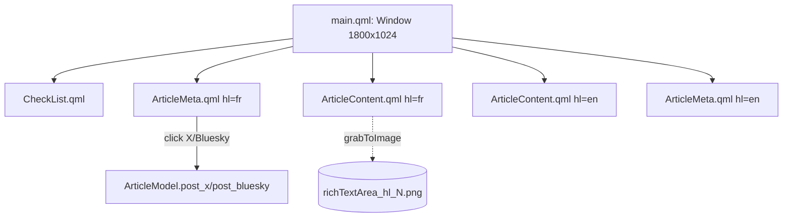

# Legacy Qt / QML UI

> **LEGACY.** Superseded by the [[web-ui]]. Still present and runnable via
> `writerhelper_qt.py` → `backend.py` → `model.py` → `ui/qml/`, kept as a fallback. New
> UI work goes in `web/`.
>
> ⚠️ **Do not run it now.** `model.py` still emits [[jekyll-format]] and reads the shared
> `settings_<hl>.ini`, which were repointed at the Astro repo
> ([[file-storage]]). Running it would write Jekyll files (no `translationKey`, has
> `layout`/`categories`) into the Astro blog folders and break the site build. Porting
> `model.py` to the serializer seam (or retiring it) is an open follow-up.

PySide6 loads `main.qml` via `QQmlApplicationEngine` in `writerhelper_qt.py`, exposing
the `Backend` QObject as the root `backend` property.

Each `ArticleContent`/`ArticleMeta` binds to one language's `ArticleModel` via
`hl_model: root.backend.article(hl)`; all bindings go through `hl_model.p_*` properties,
refreshed by the Qt `updated` **signal** (the Qt twin of the web stack's plain
`updated()` method).

## Components

- **main.qml** — Window 1800×1024; top green strip with FR/EN visibility checkboxes; a
  `RowLayout` of CheckList | FR-meta | FR-content | EN-content | EN-meta; bottom fr_CA
  clock on a 1s Timer.
- **ArticleContent.qml** (~500 lines) — per-language editor + the capturable
  `richTextArea` Rectangle. A 2s Timer flushes focused fields into `set_title`/
  `set_content` as a fallback to `onEditingFinished`.
- **ArticleMeta.qml** — button grid, Image field, the Links grid; the `X/Twitter` and
  `Bluesky` labels are rich-text `<a>`s whose `onLinkActivated` calls
  `hl_model.post_x()`/`post_bluesky()` — the legacy single-shot posting path (no
  confirmation popup; the web stack replaced this with [[social-publishing]]).
- **CheckList.qml** — a static, non-persisted manual-workflow checklist (write →
  generate image → proofread → translate → tags → share to Typeshare/X/Bluesky/Facebook
  → push to GitHub). Steps 4/7/8 have automated paths; the rest are manual. WriterHelper
  never touches git — the operator pushes the saved `.md`.
- **Setting.qml** / **WordWrapCheckBox.qml** — small reusable containers.

## Image capture (`grabToImage`)

`ArticleContent.qml` grabs the `richTextArea` Rectangle to `richTextArea_<hl><N>.png`
(0-indexed counter incremented in `grabCallback`, so files are `..._1.png`, `..._2.png`,
…), paginating by advancing `contentFlickable.contentY` one screen until `atYEnd`. Same
output contract as the web `capture.js` ([[image-card-capture]]). Sizing helpers
(Adjust/Square/500x400/Portrait/Landscape + `adjustFontSize`) match the web port.

## See also
- [[web-ui]] — the replacement · [[article-model]] — the `p_*` properties' source
- [[social-publishing]] — the replacement for the click-to-post labels
