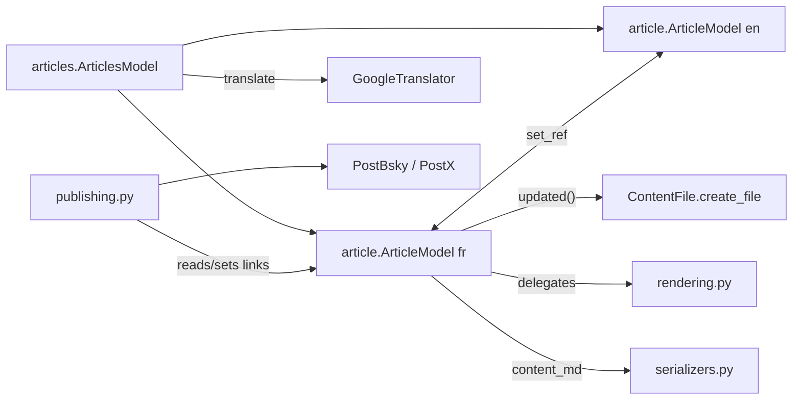

# Model layer

The Qt-free data + rendering layer, split out of the old monolithic `model.py` (now
legacy, [[legacy-qt-ui]]) into focused modules. None import PySide6; all are
unit-tested directly.

- `article.py` — [[article-model]] (`ArticleModel`, one per language) + `Link`. State,
  setters (each → `updated()` auto-save), slug, length category, links, navigation,
  the `change_article` parser entry.
- `rendering.py` — [[rendering-module]]: pure functions for the HTML
  [[content-flavors]], footer, hashtags, plain-text, local-image embedding. Stateless;
  takes an `article`.
- `articles.py` — [[articles-model]] (`ArticlesModel`) pairs FR + EN and owns
  `translate` ([[machine-translation]]).
- `publishing.py` — [[publishing]]: the two-phase [[social-publishing]] flow +
  `PLATFORMS` registry.
- `serializers.py` — [[serializers]]: the file-format seam ([[astro-format]] /
  [[jekyll-format]]).

## Key contracts

- `ArticleModel.__init__(hl, config_dir=".")` — `config_dir` locates `settings_<hl>.ini`
  (tests point it at a temp dir).
- `DEFAULT_TAGS = "Gamsblurb"` lives in `article.py` — the seed tag / always-present
  house category.
- `ArticleModel` exposes thin `content_md*()` methods delegating to `rendering.py`, so
  callers can use either.

## See also
- [[overview]] · [[web-ui]] — how the UI reaches this layer
- [[file-storage]] — what `content_md` is written into
