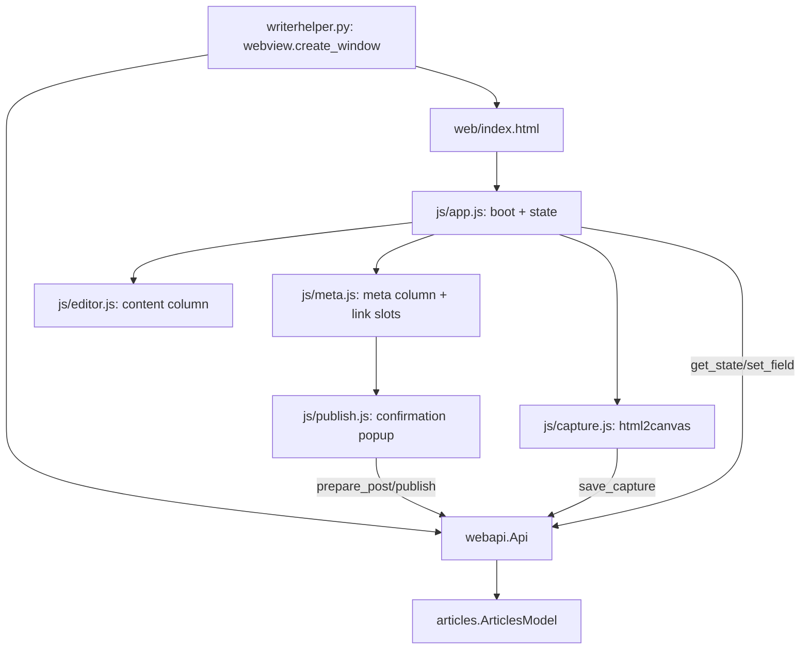

# Web UI (`web/`)

The current UI: a pywebview window (`writerhelper.py`) hosting `web/index.html`. Python
exposes `webapi.Api` as `js_api`; JS reaches it via `window.pywebview.api`
([[webapi-bridge]]). State is pull-based ([[auto-save-and-pull-ui]]).

## Layout

Top bar (green strip): title + FR/EN visibility checkboxes + fr-CA clock. Then a flex
row: checklist sidebar | FR meta | FR content | EN content | EN meta. Columns are plain
`<section>`s; hiding toggles a `.hidden` class. Matches the old 4-column QML layout
([[legacy-qt-ui]]).

## JS modules

- `js/api.js` — promise wrapper over the bridge (`API.method(...)`); routes `http` link
  clicks through `open_url` so the webview never navigates away.
- `js/app.js` — boot, shared `state`, `debounce`, `setValue` (skips focused inputs),
  `refresh(hl)`/`refreshAll()`/`setField`/`setLink` (all re-fetch after mutating),
  1s fr-CA clock, modal overlay-close, `toast`.
- `js/editor.js` — builds + wires the content column; `restyleCard` replicates the card
  colors.
- `js/meta.js` — builds + wires the meta column; renders link slots, attaches publish
  buttons.
- `js/capture.js` — sizing helpers + html2canvas pagination ([[image-card-capture]]).
- `js/publish.js` — the confirmation popup ([[social-publishing]]).
- `js/dev-mock.js` + `dev.html` — browser-only dev harness (fake bridge); never loaded
  by the real app (and `dev.html` must stay UTF-8, [[invariants-and-traps]]).

## Content column (`editor.js`)

Header (length label, "<hl> Article", char/word counter), posts-folder + website-URL
inputs, title + slug line, date-override checkbox/input, the content `<textarea>`, a
controls row (Font / G / B / W / H / Center), the buttons row
(Grab/Adjust/Square/Portrait/Landscape/500x400), short-content preview, the `.card-frame`
capture surface, then read-only previews of `content_md_separators_br` and `content_md`.
Every `[data-field]` input debounce-saves on `input` and immediately on `change`. Font/
W/H/Center are **local only** (`restyleCard`, no backend round-trip — card geometry isn't
persisted).

## Meta column (`meta.js`)

Button grid (New / Translate / Open / Make V2 / Open Prev / Open Next / New both
articles — each awaits the bridge then `App.refreshAll`), the Image field (text input +
**Browse…** button + a **drop zone**/preview ``), the Links grid, the Tags field,
the **Facets** checkbox grid (5 values), and the **Draft** toggle. Dropping or browsing
an image hands it to the backend as a `data:` URL → the self-hosting hook turns it into
webp ([[astro-format]]); `Meta.wireImage` wires both. `app.js` swallows file-drops
outside a `.img-drop` zone so a stray drop can't navigate the webview to the file. Facets/Draft are pair-shared → handlers persist then `refreshAll`
so BOTH columns reflect the change; the Facets section flags red until ≥1 is picked
(facets are mandatory, [[social-publishing]]). Link slots render one `.link-row` each;
slots with `publish` (`x`/`bluesky`) get a button opening `Publish.open`; rows update in
place and aren't overwritten while focused.

## Theme (`style.css`)

Green identity (`--green-strip #2e7d32`, `--green-dark #24475b`, `--accent #ade6b9`).
Columns are fixed-width flex items in a horizontally-scrolling row; `.hidden` removes
them.

## See also
- [[webapi-bridge]] · [[image-card-capture]] · [[social-publishing]] · [[model-layer]]
