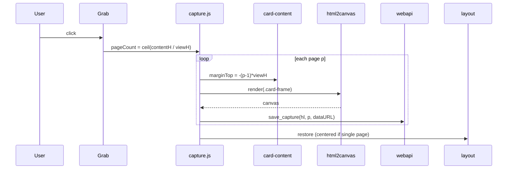

# Image-card capture (html2canvas)

The branded post-image generation. Ported from QML `grabToImage` to `js/capture.js`
using vendored **html2canvas** (`web/vendor/html2canvas.min.js`, v1.4.1). The legacy
QML path still exists ([[legacy-qt-ui]]) but the web path is live.

## The surface

`.card-frame` (id `card-<hl>`) holds an absolutely-positioned `.card-inner` (9px margin
= old `contentMargin`) → `.card-scroll` → `.card-content` (the `content_md_separators`
HTML, [[content-flavors]]), a `.card-watermark` (a per-`hl` `MartinGamsby.com/<hl>`
watermark), and a `.card-page` badge. Frame width/height come from the W/H number
inputs; colors from the green/black checkboxes via `Editor.restyleCard`.

## Output naming (load-bearing contract)

`richTextArea_<slug>_<hl><N>.jpg`, `<N>` 1-indexed, written to CWD. **JPEG** (so it
doubles as the Instagram asset, [[instagram-adapter]]) and **named by the article's
slug** so a capture is tied to the article it was grabbed for — image-mode publishing
resolves the *current* article's slug, so a stale grab from a different post (or an
edited title → new slug) simply isn't found. `capture.js` produces the JPEG data URL
(`toDataURL('image/jpeg', 0.92)`, white bg since JPEG has no alpha) and paginates by
translating `.card-content` up one viewport (`marginTop`) per page; each page is sent to
`webapi.save_capture(hl, page, dataURL)` ([[webapi-bridge]]), which builds the filename
via the single source of truth `publishing.capture_filename(article, page)`. Page 1
(`image_filename(article)`) is what image-mode [[social-publishing]] attaches. Don't
rename without updating producer (`capture.js`/`save_capture`) and consumer
(`publishing`) together.

## Sizing helpers

| Button | Effect |
|---|---|
| Adjust | Shrink H until content overflows, then bump up one step (32px). |
| Square | H = card width, then `adjustFontSize`. |
| 500x400 | H = width*4/5, then `adjustFontSize`. |
| Portrait | H = width*5/4, then `adjustFontSize`. |
| Landscape | H = width*9/16, then `adjustFontSize` (extra shrink if <300 chars). |

`adjustFontSize` grows the font while content fits one page, then trims; drops a step
for <1000 chars, another for <300. `fitsOnePage` compares `content.offsetHeight` to
`scroll.clientHeight`. Single-page → `.card-scroll.centered` + page badge hidden.

## Card colors (replicates the QML look)

- Green checked → `#24475b` bg, white text.
- Black checked (green off) → black bg, white text.
- Neither → white bg, `#000033` text.

Watermark `#7a9295` (green) else silver; page badge `#ade6b9` (green) / `#000033`
(black) / white.

## See also
- [[content-flavors]] — the `content_md_separators` being captured
- [[social-publishing]] — consumer of the PNG
- [[web-ui]] · [[webapi-bridge]]
