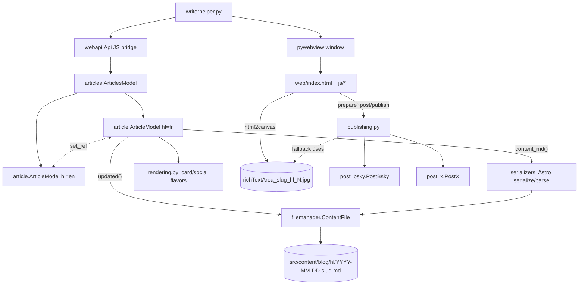

# Overview

WriterHelper is a personal, single-user, Windows desktop app for authoring the
**bilingual (FR/EN) blog** behind [[martingamsby-site]] (the Astro site at
martingamsby.com, one repo replacing two old Jekyll blogs). It pairs a French and an
English article side by side, **auto-saves** an Astro `.md` post on every edit, renders
a branded social image from the content, and publishes to Bluesky and X behind a
confirmation popup.

The whole point: write a post once, keep its FR/EN twin in lockstep, and get it onto
the site + socials with minimal ceremony. Twins are coupled by a sticky
`translationKey` ([[bilingual-pairing]]); the site's language toggle resolves through
it. Pair-shared `facets` (the site's "doors") and `draft` mirror across both languages.

## Two stacks, one live

- **Active: pywebview + web UI.** `writerhelper.py` opens a pywebview window hosting
  `web/index.html`; all logic is Qt-free Python reached over the `window.pywebview.api`
  bridge ([[webapi-bridge]]). The data layer is the split modules
  [[article-model]] / [[articles-model]] / [[rendering-module]] / [[publishing]], with
  the file-format seam in [[serializers]]. See [[web-ui]].
- **Legacy: PySide6 / QML.** `writerhelper_qt.py` → `backend.py` → `model.py` →
  `ui/qml/`. Still runs, no longer primary, and **must not be run now** because
  `model.py` still emits Jekyll into the repointed Astro folders. See [[legacy-qt-ui]].

## Stack

Python 3 + pywebview (Edge WebView2 on Windows) + atproto, tweepy, deep_translator,
requests, markdown, beautifulsoup4, pyyaml, unidecode. Frontend: vanilla JS, no build
step, vendored html2canvas. Packaged with PyInstaller (`writerhelper.spec`).

## Where things live

- Posts are written into the sibling [[martingamsby-site]] checkout
  (`src/content/blog/{fr,en}/`); the operator commits + pushes by hand. See
  [[file-storage]].
- The save lifecycle, the rename-by-delete trick, and the pull-based UI: [[auto-save-and-pull-ui]].
- The five render shapes of one article: [[content-flavors]].
- Publishing decision + two-phase flow + popup: [[social-publishing]].
- The non-negotiables: [[invariants-and-traps]]. Secrets handling: [[secrets]].

Start a session by reading [[index]], [[glossary]], and this page.
